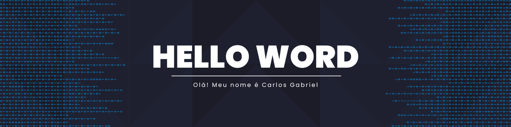
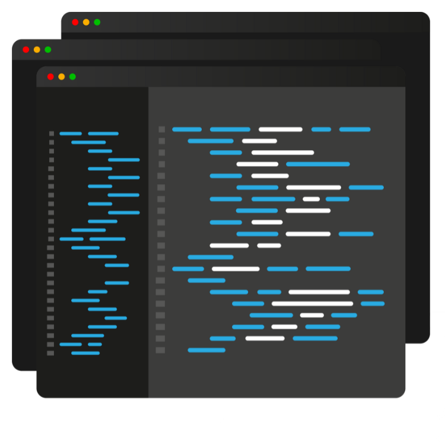

 

  <h2>Resumo Profissional</h2>

   <strong>Desenvolvedor de Sistemas</strong> atualmente <strong>Full Stack</strong>, apaixonado por novas Tecnologias e Inovações. Focado em aprendizado contínuo, busco aplicar meus conhecimentos e contribuir em <strong>Projetos Reais do Mercado de Trabalho</strong>. Guiado pela Curiosidade e pela Incessante vontade de Aprender, atualmente estou me aventurando no aprendizado de <strong>Computação em Nuvem</strong> em Plataformas como <strong>Google Cloud</strong> e <strong>Azure</strong> 

---

  <h3>Sobre mim</h3>
  

  
 🎓 | Técnico em <strong>Desenvolvimento de Sistemas - SENAI</strong>

  
 🎓 | Técnico em <strong>Informática para Internet - Proz</strong>
  
  

  
   

---

  <h2>GitHub Stats </h2>

---

  
## Tecnologias e Linguagens 

### Frameworks e Bibliotecas

### Ferramentas

---

  <h2>Formas de Contato</h2>

  
  

