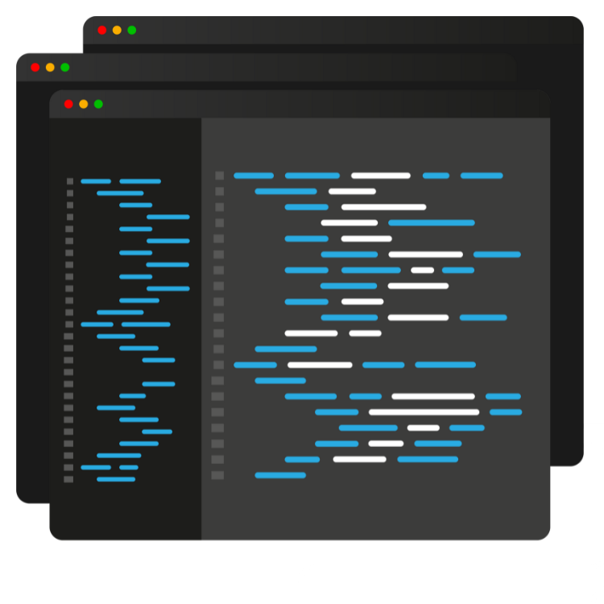
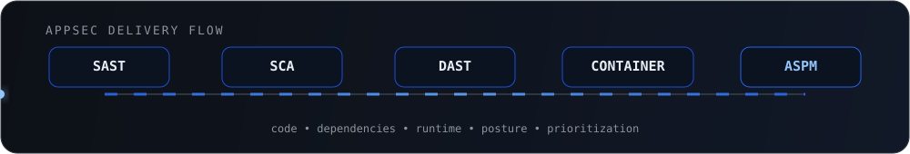

<!--
  Carlos Gabriel — GitHub Profile
  Idioma principal: pt-BR
  Visual system: terminal / engineering / blue-slate
-->

<div align="center">


<h1>Carlos Gabriel</h1>

<p><strong>Analista de Desenvolvimento Jr. · Full Stack</strong></p>


<br>

<a href="./README.md"></a>
<a href="./README.en.md"></a>
&nbsp;
<a href="https://www.linkedin.com/in/dev-carlosgabriel/"></a>
<a href="https://carlosgabriel.netlify.app/"></a>
<a href="mailto:carlosgabriel.contato2007@gmail.com"></a>

<br><br>

<sub><strong>São Paulo, SP</strong> &nbsp;·&nbsp; Xmart Solutions &nbsp;·&nbsp; UNICID &nbsp;·&nbsp; Inglês B2</sub>

</div>


<div align="center">

## `01` · perfil

<sub>DESENVOLVIMENTO · PRODUTO · OPERAÇÃO · SEGURANÇA</sub>

</div>

<br>



### Engenharia de software com visão de ponta a ponta

Atuo na **Xmart Solutions** como **Analista de Desenvolvimento de Sistemas Jr.**, participando da evolução de **plataforma SaaS, interfaces web, sistemas internos e produtos de AppSec**.

Minha base principal está em **TypeScript, JavaScript, React, Next.js e Python**. Complemento o desenvolvimento com experiência prática em **Linux, infraestrutura, observabilidade, cloud, segurança de aplicações e Supply Chain Security**.

Gosto de entender a entrega inteira: **interface, regra de negócio, dados, autenticação, segurança, deploy, monitoramento, troubleshooting e manutenção**.

```text
╭─ carlos@engineering ─────────────────────────╮
│  foco      desenvolvimento · produto         │
│  stack     ts · react · next · python        │
│  contexto  dados · devops · appsec           │
│  método    entender · construir · validar    │
╰──────────────────────────────────────────────╯
```

<br clear="right">


<div align="center">

## `02` · conhecimentos

<sub>STACK ORGANIZADA POR ENTREGA E EXPERIÊNCIA</sub>

<br><br>

### Desenvolvimento


<br><br>

### Dados, plataforma & operação


</div>

<br>

<table>
<tr>
<td width="50%" valign="top">

<strong>⌘ Desenvolvimento & Produto</strong>

<br><br>

TypeScript · JavaScript · React · React Native · Expo · Next.js · Node.js · Python · FastAPI · HTML · CSS · Tailwind CSS · APIs REST · UX/UI

</td>
<td width="50%" valign="top">

<strong>◫ Dados & Aplicações</strong>

<br><br>

SQL · PostgreSQL · SQLite · Supabase · Prisma · SQLAlchemy · autenticação · JWT · RBAC · logs de auditoria

</td>
</tr>
<tr>
<td width="50%" valign="top">

<strong>△ DevOps & Observabilidade</strong>

<br><br>

Linux · Proxmox · Docker · Git/GitHub · Vercel · Azure · AWS · GCP · Zabbix · Grafana · Prometheus · troubleshooting

</td>
<td width="50%" valign="top">

<strong>◇ Engenharia</strong>

<br><br>

Testes de software · validação · documentação técnica · arquitetura · Git workflow · Scrum · Kanban · manutenção · melhoria contínua

</td>
</tr>
</table>


<div align="center">

## `03` · AppSec na prática

<sub>SAST · SCA · DAST · CONTAINER · ASPM</sub>

<br><br>



<br>


</div>

<br>

<table>
<tr>
<td width="50%" valign="top">

<strong>Secure Software</strong>

<br><br>

Experiência prática com **fluxos e achados de SAST e DAST**, leitura de findings, severidade, contexto técnico, validação de resultados, falsos positivos e apoio à evolução da experiência de análise.

</td>
<td width="50%" valign="top">

<strong>Software Supply Chain</strong>

<br><br>

Atuação com **SCA, SBOM e Supply Chain Security**, incluindo contato com o ecossistema **Sonatype Nexus Repository, Lifecycle/IQ e Firewall**.

</td>
</tr>
<tr>
<td width="50%" valign="top">

<strong>Cloud-Native Security</strong>

<br><br>

Contato prático com **segurança de containers**, além de contexto de **IaC e Secrets** dentro de fluxos de segurança e centralização de achados.

</td>
<td width="50%" valign="top">

<strong>ASPM & Gestão de Risco</strong>

<br><br>

Experiência com **ASPM** no contexto do XGuardian, centralizando modalidades de scan, contextualizando findings e apoiando visibilidade, priorização, métricas e gestão de risco de aplicações.

</td>
</tr>
</table>

<sub>Meu posicionamento principal continua sendo desenvolvimento de software. AppSec entra como uma competência prática complementar, construída em produto real e rotina técnica.</sub>


<div align="center">

## `04` · experiência

<sub>PRODUTO · DESENVOLVIMENTO · OPERAÇÃO · APPSEC</sub>

</div>

### Xmart Solutions

**Analista de Desenvolvimento de Sistemas Jr.** · `jun/2026 → atual`

Atuação na evolução de **plataforma SaaS, interfaces web e sistemas internos**, conectando desenvolvimento à operação e segurança.

- Desenvolvimento e manutenção com **Python, JavaScript/TypeScript e React**.
- Redesign da interface do **XGuardian** e desenvolvimento de sua página institucional, com foco em **UX/UI, responsividade e consistência visual**.
- Experiência prática com o contexto de **SAST, SCA, DAST, ASPM, Container Security, IaC e Secrets** dentro do ecossistema XGuardian.
- Administração e troubleshooting de **servidores Linux** e virtualização com **Proxmox**.
- Observabilidade e monitoramento com **Zabbix, Grafana e Prometheus**.
- Atuação com **Sonatype Nexus** e práticas de **AppSec / Supply Chain Security**.
- Documentação técnica, organização de fluxos e padronização de processos.

<details>
<summary><strong>↳ trajetória na Xmart</strong></summary>
<br>

**Estagiário de Desenvolvimento de Sistemas** · `dez/2025 → jun/2026`

Atuação inicial em desenvolvimento web, suporte técnico, infraestrutura, observabilidade, segurança de aplicações e documentação. Nesse período, também participei da recuperação de ativos, organização de ambientes, administração básica do Proxmox, implantação de monitoramento com Zabbix/Grafana e implantação interna do SysPass.

**Progressão:** Estagiário → Analista de Desenvolvimento de Sistemas Jr. em junho de 2026.

</details>


<div align="center">

## `05` · projetos selecionados

<sub>PRODUTO · ARQUITETURA · EXPERIÊNCIA · ENTREGA</sub>

</div>

### `01 /` Toca dos Pés

`FULL STACK` &nbsp; `FREELANCE` &nbsp; `HOMOLOGAÇÃO PRIVADA`

Sistema de gestão para uma clínica de podologia, centralizando **agenda, clientes, profissionais, serviços, produtos, fornecedores, estoque, financeiro, prontuários e relatórios**.

**Papel** · concepção, arquitetura e desenvolvimento Full Stack  
**Stack** · `Next.js` `React` `TypeScript` `Tailwind CSS` `Prisma` `PostgreSQL` `Supabase` `Supabase Auth` `RBAC` `Vercel`  
**Engenharia** · validações client/server, auditoria, segurança, LGPD, typecheck, lint, build, auditoria de dependências e smoke tests

<sub>Ambiente privado de homologação para proteção de dados e acessos do cliente.</sub>

<br>

### `02 /` Clarium

`MOBILE` &nbsp; `LOCAL-FIRST` &nbsp; `PRODUÇÃO`

Aplicativo de finanças pessoais para **receitas, despesas, compras no cartão, planejamento mensal e indicadores**, acompanhado de uma landing page oficial multilíngue.

**App** · `React Native` `Expo` `Expo Router` `TypeScript` `SQLite`  
**Web** · `Next.js 14` `TypeScript` `Tailwind CSS` `next-intl` `Vercel`  
**Foco** · arquitetura frontend/mobile, persistência local, internacionalização, UI/UX e entrega de produto

<a href="https://clarium.vercel.app/"><strong>Abrir projeto ↗</strong></a> &nbsp;·&nbsp;
<a href="https://github.com/CarlossgLuz/controle-fatura">App ↗</a> &nbsp;·&nbsp;
<a href="https://github.com/CarlossgLuz/landingpage_clarium">Landing ↗</a>

<br>

### `03 /` Fatal Lady

`E-COMMERCE` &nbsp; `WEB + MOBILE` &nbsp; `PROJETO SENAI`

E-commerce completo desenvolvido em equipe, composto por **site e aplicativo mobile**, com fluxos de catálogo, produto, carrinho, favoritos, autenticação, conta do cliente e pedidos.

**Minha atuação principal** · desenvolvimento **Frontend e UX/UI**, criação de interfaces responsivas, hierarquia visual, componentes, estados e integração com dados do backend  
**Backend de referência** · `Python` `FastAPI` `SQLAlchemy` `JWT` `SQL`  
**Mobile** · evolução/refinamento em `Expo` `React Native` `TypeScript`, com foco em experiência mobile-first e consistência de design

O projeto foi importante para consolidar prática em **trabalho em equipe, integração frontend/backend, organização de arquitetura e construção de experiência de e-commerce orientada ao usuário**.

<br>

### `04 /` Portfólio Profissional

`WEB` &nbsp; `MULTILÍNGUE` &nbsp; `PRODUÇÃO`

Portfólio profissional construído com foco em **UX/UI, acessibilidade, identidade visual, SEO técnico, responsividade e performance**, com versões em português, inglês e espanhol.

**Stack** · `HTML` `CSS` `JavaScript` `i18n` `Open Graph` `JSON-LD` `Netlify`

<a href="https://carlosgabriel.netlify.app/"><strong>Visitar portfólio ↗</strong></a> &nbsp;·&nbsp;
<a href="https://github.com/CarlossgLuz/portfolio_profissional">Código ↗</a>


<div align="center">

## `06` · formação & credenciais

<sub>BASE TÉCNICA EM EVOLUÇÃO CONTÍNUA</sub>

</div>

<table>
<tr>
<td width="55%" valign="top">

<strong>Formação</strong>

<br><br>

**Tecnologia em Análise e Desenvimento de Sistemas**  
Universidade Cidade de São Paulo — **UNICID**  
`jun/2026 → previsão jun/2027` · Em andamento

<br>

**Técnico em Desenvolvimento de Sistemas**  
**SENAI São Paulo**  
`jul/2024 → jun/2026` · Concluído

<br>

**Técnico em Informática para Internet**  
**Proz Educação**  
`jan/2023 → dez/2024` · Concluído

</td>
<td width="45%" valign="top">

<strong>Certificações & Idiomas</strong>

<br><br>

**Microsoft Certified: Azure Fundamentals**  
`AZ-900` · Microsoft · fev/2026

<br>

**Scrum Foundation Professional Certification**  
`SFPC` · CertiProf · válida até out/2027

<br>

**Português** · Nativo  
**Inglês** · Intermediário B2

</td>
</tr>
</table>

<div align="center">

<a href="https://www.credly.com/users/carlos-gabriel.3078ca93"></a>
<a href="https://drive.google.com/drive/folders/1tqgqmkPdQKNs1aRKDJx9HC5pRPwwvDYn?usp=sharing"></a>

</div>


<div align="center">

## `07` · engenharia além do código

```text
produto
  └─ experiência
      └─ código
          └─ dados
              └─ segurança
                  └─ deploy
                      └─ observabilidade
                          └─ operação
                              └─ evolução
```

<strong>Software bom não termina no <code>git push</code>.</strong>

<br><br>

<sub>Meu foco é construir soluções claras para quem usa, sustentáveis para quem mantém e observáveis para quem opera.</sub>

</div>


<div align="center">

### `connect()`

<a href="mailto:carlosgabriel.contato2007@gmail.com"></a>
<a href="https://www.linkedin.com/in/dev-carlosgabriel/"></a>
<a href="https://carlosgabriel.netlify.app/"></a>

<br><br>

<sub>São Paulo, SP · Desenvolvimento de Sistemas · Full Stack · DevOps · AppSec</sub>


</div>
