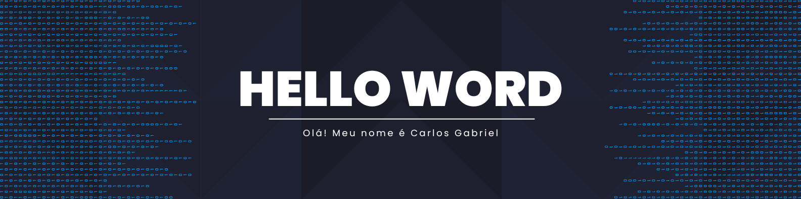

<!--
  GitHub Profile — Carlos Gabriel
  Visual system: terminal / engineering / blue-slate
-->

 

  

  

 

## `01 // profile`

<table>
<tr>
<td width="68%" valign="middle">

<h3>Analista de Desenvolvimento de Sistemas Jr. · Full Stack</h3>

Atuo na <strong>Xmart Solutions</strong> desenvolvendo e evoluindo
<strong>plataforma SaaS, interfaces web e sistemas internos</strong>.

Minha base está em <strong>TypeScript, JavaScript, React, Next.js e Python</strong>,
conectando desenvolvimento a <strong>UX/UI, dados, Linux, observabilidade, cloud e AppSec</strong>.

Tenho perfil generalista: gosto de entender a solução da interface à operação,
com atenção a <strong>arquitetura, segurança, observabilidade, documentação e manutenção</strong>.

<pre>
┌─ carlos@engineering ───────────────────────────┐
│ role   → development analyst jr.               │
│ scope  → full stack · devops · appsec          │
│ method → understand · build · validate · ship  │
└────────────────────────────────────────────────┘
</pre>

</td>
<td width="32%" align="center" valign="middle">

</td>
</tr>
</table>

---

## `02 // capabilities`

O que eu conecto para entregar software de ponta a ponta.

 

<table>
<tr>
<td width="50%" valign="top">

<h3><code>&lt;/&gt;</code> Desenvolvimento</h3>

<strong>React · Next.js · TypeScript · JavaScript · Python</strong>

Interfaces, aplicações web, APIs, integrações, mobile, UX/UI, testes e documentação técnica.

</td>
<td width="50%" valign="top">

<h3><code>DB</code> Dados &amp; Aplicações</h3>

<strong>PostgreSQL · SQLite · Supabase · Prisma</strong>

Persistência, modelagem, autenticação, RBAC, validações e logs de auditoria.

</td>
</tr>
<tr>
<td width="50%" valign="top">

<h3><code>OPS</code> Operação &amp; Confiabilidade</h3>

<strong>Linux · Proxmox · Docker · Cloud</strong>

Troubleshooting, deploy, virtualização, Zabbix, Grafana e Prometheus.

</td>
<td width="50%" valign="top">

<h3><code>SEC</code> AppSec</h3>

<strong>Sonatype Nexus · XGuardian · DevSecOps</strong>

Segurança de aplicações, Supply Chain Security, controle de acesso e análise de riscos.

</td>
</tr>
</table>

---

## `03 // stack`

CORE DEVELOPMENT

  

  

DATA · PLATFORM · OPERATIONS

  

  

<code>React Native</code> · <code>Expo</code> · <code>Prisma</code> · <code>REST APIs</code> ·
<code>Zabbix</code> · <code>Grafana</code> · <code>Prometheus</code> · <code>Proxmox</code>

---

## `04 // experience`

DESENVOLVIMENTO + PRODUTO + OPERAÇÃO

 

<table>
<tr>
<td width="24%" valign="top">

<strong>jun/2026 → atual</strong>
  
<code>CURRENT</code>

</td>
<td width="76%" valign="top">

<h3>Xmart Solutions · Analista de Desenvolvimento de Sistemas Jr.</h3>

Desenvolvimento e manutenção de <strong>plataforma SaaS, páginas, fluxos e sistemas internos</strong>
com Python, JavaScript/TypeScript e React.

<ul>
<li>Redesign da interface do <strong>XGuardian</strong> e desenvolvimento de sua página institucional.</li>
<li>Administração e troubleshooting de <strong>Linux + Proxmox</strong>.</li>
<li>Observabilidade com <strong>Zabbix, Grafana e Prometheus</strong>.</li>
<li>Atuação próxima a <strong>AppSec e Supply Chain Security</strong> com Sonatype Nexus e XGuardian.</li>
<li>Documentação técnica e padronização de processos.</li>
</ul>

</td>
</tr>
<tr>
<td width="24%" valign="top">

<strong>dez/2025 → jun/2026</strong>
  
<code>START</code>

</td>
<td width="76%" valign="top">

<h3>Xmart Solutions · Estagiário de Desenvolvimento de Sistemas</h3>

Atuação em desenvolvimento web, infraestrutura, suporte, observabilidade e segurança de aplicações,
com evolução para <strong>Analista Jr. em junho de 2026</strong>.

</td>
</tr>
</table>

---

## `05 // selected_work`

Projetos que mostram contexto, arquitetura e entrega — não apenas código.

 

<table>
<tr>
<td width="50%" valign="top">

<h3>Toca dos Pés</h3>

<code>FULL STACK</code> <code>FREELANCE</code> <code>STAGING</code>

Sistema de gestão para centralizar agenda, clientes, profissionais, estoque,
financeiro, prontuários e relatórios de uma clínica de podologia.

<strong>Minha atuação</strong> 
Concepção, arquitetura e desenvolvimento Full Stack.

<strong>Stack</strong> 
<code>Next.js</code> <code>React</code> <code>TypeScript</code> <code>Prisma</code>
<code>PostgreSQL</code> <code>Supabase</code> <code>RBAC</code> <code>Vercel</code>

<strong>Entregas</strong> 
Autenticação, controle de acesso, cadastros centrais, agenda inicial,
auditoria e validações client/server.

Ambiente privado de homologação para proteção dos dados e acessos do cliente.

</td>
<td width="50%" valign="top">

<h3>Clarium</h3>

<code>MOBILE</code> <code>LOCAL-FIRST</code> <code>PUBLISHED</code>

Aplicativo de finanças pessoais para receitas, despesas, cartão,
planejamento mensal e indicadores, com persistência local.

<strong>Produto</strong> 
App mobile + landing page multilíngue para apresentação e distribuição.

<strong>Stack</strong> 
<code>React Native</code> <code>Expo</code> <code>TypeScript</code>
<code>SQLite</code> <code>Next.js</code> <code>Tailwind CSS</code>

<a href="https://clarium.vercel.app/"><strong>Abrir projeto ↗</strong></a> ·
<a href="https://github.com/CarlossgLuz/controle-fatura">App ↗</a> ·
<a href="https://github.com/CarlossgLuz/landingpage_clarium">Landing ↗</a>

</td>
</tr>
</table>

<table>
<tr>
<td valign="top">

<h3>Portfólio Profissional</h3>

<code>WEB</code> <code>MULTILINGUAL</code> <code>PRODUCTION</code>

Portfólio profissional desenvolvido com foco em <strong>UX/UI, acessibilidade,
identidade, SEO técnico e performance</strong>.

<code>HTML</code> · <code>CSS</code> · <code>JavaScript</code> · <code>i18n</code> ·
<code>Dark/Light Theme</code> · <code>Open Graph</code> · <code>JSON-LD</code> · <code>Netlify</code>

<a href="https://carlosgabriel.netlify.app/"><strong>Visitar portfólio ↗</strong></a> ·
<a href="https://github.com/CarlossgLuz/portfolio_profissional">Código ↗</a>

</td>
</tr>
</table>

---

## `06 // education`

<table>
<tr>
<td width="55%" valign="top">

<h3>Formação</h3>

<strong>Análise e Desenvolvimento de Sistemas</strong> 
Universidade Cidade de São Paulo — <strong>UNICID</strong> 
<code>jun/2026 → previsão jun/2027</code> · Em andamento

<strong>Técnico em Desenvolvimento de Sistemas</strong> 
<strong>SENAI São Paulo</strong> 
<code>jul/2024 → jun/2026</code> · Concluído

<strong>Técnico em Informática para Internet</strong> 
<strong>Proz Educação</strong> 
<code>jan/2023 → dez/2024</code> · Concluído

</td>
<td width="45%" valign="top">

<h3>Certificações</h3>

<strong>Microsoft Certified: Azure Fundamentals</strong> 
<code>AZ-900</code> · Microsoft · fev/2026

<strong>Scrum Foundation Professional Certification</strong> 
<code>SFPC</code> · CertiProf · válida até out/2027

<h3>Idiomas</h3>

<strong>Português</strong> · Nativo 
<strong>Inglês</strong> · Intermediário (B2)

</td>
</tr>
</table>

---

## `07 // engineering_mindset`

<pre>
┌─────────┐   ┌─────────┐   ┌─────────┐   ┌─────────┐   ┌─────────┐
│   UX    │ → │  CODE   │ → │  DATA   │ → │   SEC   │ → │   OPS   │
└─────────┘   └─────────┘   └─────────┘   └─────────┘   └─────────┘
      product → build → validate → deploy → observe → improve
</pre>

<strong>Software bom não termina no <code>git push</code>.</strong>

  

Meu foco é entregar soluções claras para quem usa, sustentáveis para quem mantém
e observáveis para quem opera.

---

## `08 // github_signal`

<strong>Visualizar GitHub Analytics</strong>

 

  
  

---

## `09 // connect`

### `open --connection carlos-gabriel`

Desenvolvimento de Sistemas · Full Stack · Produto · DevOps · AppSec

  

  

São Paulo, SP · presencial · híbrido · remoto

 

